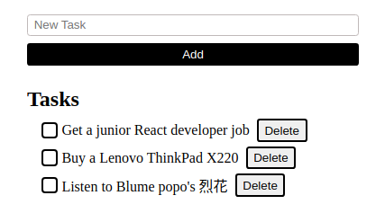

# Agendone App

A spartan to-do list web application.

The name 'Agendone' derives from the portmanteau of 'agenda' and 'done'.

## Table Of Contents

- [Demo](#demo)
- [Introduction](#introduction)
- [Features](#features)
- [Stack](#stack)

## Demo

https://agendone.vercel.app/

## Introduction

The objective is to learn and apply fundamentals of React: JSX, state, and component.

## Features

- `Add` button, `Delete` buttons, and checkboxes:

  

## Stack

- React 18
- Vite 5
